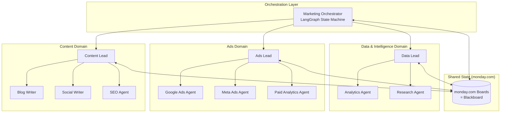
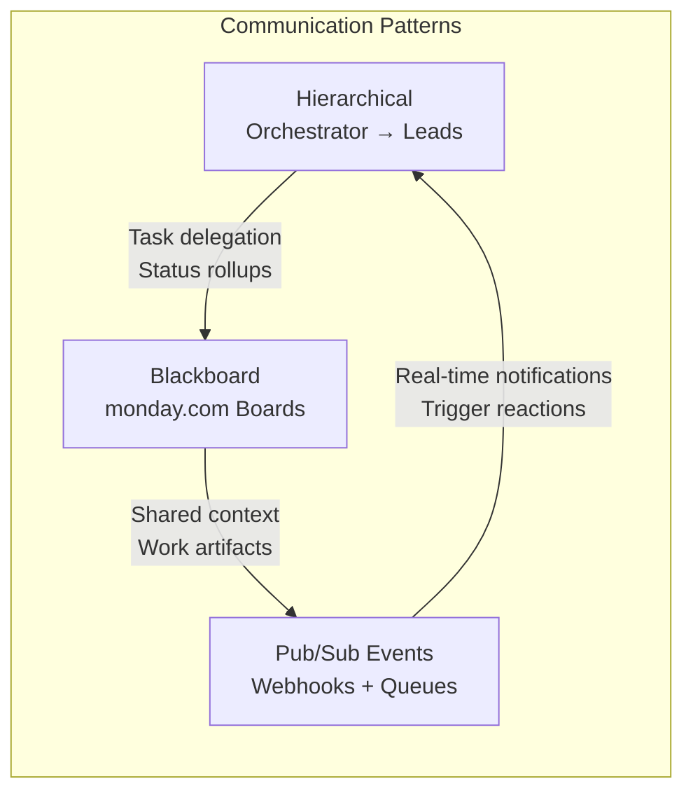
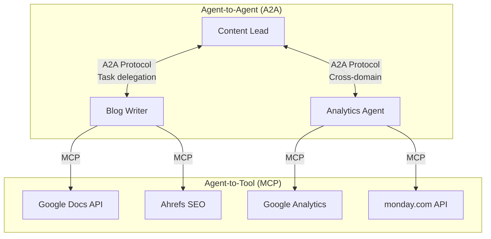
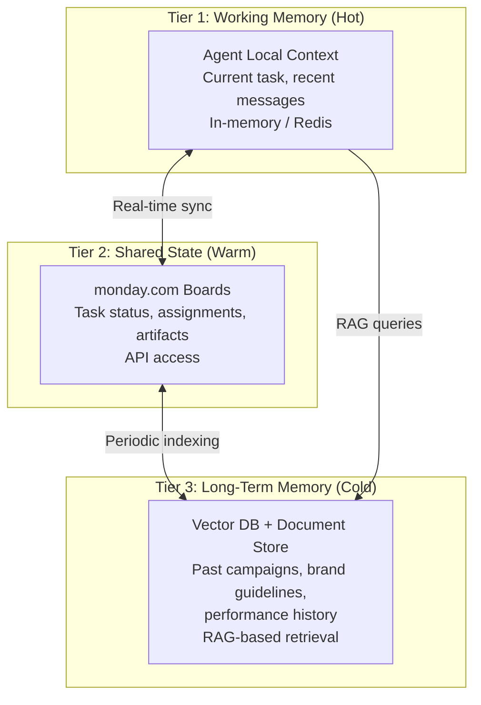
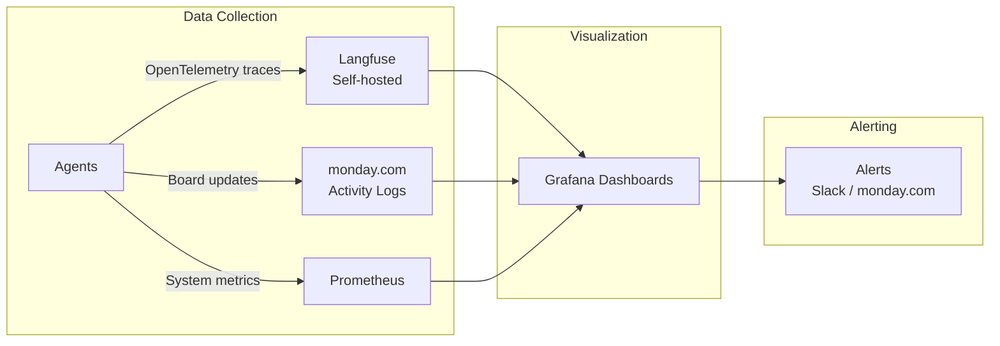

# Multi-Agent Orchestration for 11 Marketing Agents
## Deep Research & Architecture Recommendations

**Author:** Nymeria | **Date:** 2026-05-09 | **For:** Guy Regev, Director of Engineering @ monday.com

---

## Executive Summary

You have 11 specialized AI agents across marketing (content, ads, data, social, etc.) using monday.com as the communication hub. The question isn't "should we orchestrate?" — it's "what topology and tooling lets 11 agents coordinate without becoming a debugging nightmare?"

**My recommendation:** A **hybrid hierarchical + event-driven architecture** using **LangGraph** as the orchestration backbone, **monday.com boards as the shared state/blackboard**, and **Langfuse** for observability. Skip the heavyweight frameworks for now — your agents already exist and have their own runtimes. You need a coordination layer, not a rewrite.

**Key findings:**
1. **LangGraph** is the production standard for deterministic, stateful multi-agent orchestration (62% of enterprise agentic deployments in 2026)
2. **CrewAI** is great for prototyping but lacks fine-grained state control needed at your scale
3. **monday.com's own agent infrastructure** (announced 2026) is a natural fit as the blackboard/shared state layer
4. **3-layer hierarchy is overkill** for 11 agents — a **2-layer hub-and-spoke with domain supervisors** is the sweet spot
5. **A2A + MCP protocols** are the emerging interoperability standard — design for them now

---

## 1. Framework Comparison

### The Big Six — Honest Assessment

| Framework | Best For | Production Ready? | State Mgmt | Learning Curve | Your Fit |
|-----------|----------|-------------------|------------|----------------|----------|
| **LangGraph** | Complex stateful workflows, deterministic execution | ✅ Yes — gold standard | Excellent (graph-based checkpointing) | Steep | ⭐⭐⭐⭐⭐ |
| **CrewAI** | Role-based teams, rapid prototyping | ✅ Yes (Enterprise tier) | Limited (crew lifecycle) | Easy | ⭐⭐⭐ |
| **AutoGen / MS Agent Framework** | Conversational multi-agent, Azure ecosystem | ✅ Yes (post-merger) | Good (session-based) | Medium | ⭐⭐⭐ |
| **MetaGPT** | Software dev simulation, SOP-based workflows | ⚠️ Partial | Role-based SOPs | Medium | ⭐⭐ |
| **OpenAI Swarm** | Education/prototyping only | ❌ No (use Agents SDK) | Minimal | Easy | ⭐ |
| **CAMEL** | Research, multi-agent simulation | ⚠️ Research-grade | Basic | High | ⭐ |

### Framework Deep Dives

#### LangGraph — The Production Pick 🏆

**What it is:** Extension of LangChain that models agent workflows as directed graphs. Agents are nodes, edges define state flow.

**Why it wins for your case:**
- **Deterministic execution**: Every state transition is explicit and auditable
- **Built-in checkpointing**: Resume interrupted workflows from saved state
- **Human-in-the-loop**: Native support for approval gates
- **LangSmith integration**: Full observability out of the box
- **Graph-based state**: Define exactly what state passes between agents

**Limitations:**
- Steep learning curve (graph mental model)
- More boilerplate for simple flows
- Debugging complex graphs requires specialized tracing

**Real production usage:** LangChain reports enterprises using LangGraph for customer support orchestration, content pipeline management, and compliance workflows. 62% of developers building complex stateful agents chose LangGraph in a 2026 survey.

#### CrewAI — The Prototyping Favorite

**What it is:** Role-based agent framework where you define agents with roles, goals, and tools, then let them collaborate.

**Why it's tempting:**
- Intuitive mental model (mirrors real teams)
- Fast time-to-value
- Enterprise tier with SOC2, HIPAA
- Used by 60% of Fortune 500 (their claim)

**Why I don't recommend it for your 11-agent setup:**
- Less control over execution flow → debugging nightmares at scale
- Hierarchical mode can produce unpredictable delegation chains
- Agents tied to crew lifecycle (can't operate independently across sessions)
- Common pattern: "prototype in CrewAI, deploy in LangGraph"

#### AutoGen / Microsoft Agent Framework

**What it is:** Conversational multi-agent system from Microsoft Research, now merged with Semantic Kernel.

**Notable features:**
- Async-first architecture
- Deep Azure/Microsoft ecosystem integration
- Multi-language support (Python, C#, Java)
- Commercial SLAs

**Honest take:** Best if you're in a Microsoft-centric org. Not your situation at monday.com.

#### The Rest (MetaGPT, Swarm, CAMEL)

- **MetaGPT**: Interesting for SOP-based workflows but designed for software dev, not marketing
- **OpenAI Swarm**: Experimental only. Use the Agents SDK instead.
- **CAMEL**: Research-grade. Not production-ready for enterprise marketing.

---

## 2. Recommended Architecture for 11 Marketing Agents

### Why NOT a 3-Layer Hierarchy

The classic 3-layer pattern (Orchestrator → Supervisors → Workers) introduces:
- **Latency**: Every request hops through 3 LLM calls minimum
- **Token cost explosion**: Each layer summarizes and re-prompts
- **Debugging hell**: "Why did the orchestrator tell the content supervisor to tell the blog writer to use that headline?" — good luck tracing that
- **Single point of failure**: If the orchestrator goes down, everything stops

**For 11 agents, 3 layers is overengineering.** You'd have ~3-4 agents per supervisor and ~3 supervisors. That's barely worth the indirection.

### Recommended: 2-Layer Hub-and-Spoke with Domain Clusters



### Architecture Details

**Layer 1 — Marketing Orchestrator:**
- Single LangGraph state machine
- Receives high-level goals ("launch Q3 campaign for CRM product")
- Decomposes into domain-level tasks
- Monitors progress via monday.com board state
- Handles cross-domain coordination (e.g., "content needs data from analytics before writing")
- **Does NOT micromanage** — delegates and monitors

**Layer 2 — Domain Leads + Workers:**
- 3 domain clusters: Content, Ads, Data & Intelligence
- Each cluster has a lead agent that owns task breakdown within its domain
- Workers execute specific tasks
- Leads report status back to orchestrator via monday.com board updates

**Why this works for 11 agents:**
- **3 domain leads** handle local coordination (content, ads, data)
- **Orchestrator** only talks to 3 agents, not 11
- **Workers** can communicate peer-to-peer within their domain via board updates
- **Flat enough** to debug, **structured enough** to scale

### The 11 Agents, Mapped

| # | Agent | Domain | Role | monday.com Board |
|---|-------|--------|------|-------------------|
| 1 | Marketing Orchestrator | — | Task decomposition, cross-domain coordination | Master Campaign Board |
| 2 | Content Lead | Content | Content strategy, assignment, quality gate | Content Pipeline |
| 3 | Blog Writer | Content | Blog post creation, editing | Content Pipeline |
| 4 | Social Writer | Content | Social media content | Content Pipeline |
| 5 | SEO Agent | Content | Keyword research, optimization | SEO Tracking |
| 6 | Ads Lead | Ads | Campaign strategy, budget allocation | Ads Dashboard |
| 7 | Google Ads Agent | Ads | Google Ads execution | Ads Dashboard |
| 8 | Meta Ads Agent | Ads | Meta/Facebook Ads execution | Ads Dashboard |
| 9 | Paid Analytics Agent | Ads | ROAS, attribution, optimization | Ads Dashboard |
| 10 | Analytics Agent | Data | Website analytics, funnel analysis | Analytics Hub |
| 11 | Research Agent | Data | Market research, competitor intel | Research Board |

---

## 3. Communication Patterns Analysis

### Pattern Comparison for Your Setup

| Pattern | How It Works | Pros | Cons | Your Use |
|---------|-------------|------|------|----------|
| **Blackboard (Shared State)** | Agents read/write to a central store | Loose coupling, async, scalable | Conflict management, eventual consistency | ✅ Primary — via monday.com boards |
| **Hierarchical Messaging** | Top-down delegation, bottom-up reporting | Clear authority, auditable | Latency, bottleneck risk | ✅ Secondary — orchestrator → leads |
| **Pub/Sub (Event-Driven)** | Agents subscribe to topic channels | Fully decoupled, real-time | Ordering complexity, debugging | ✅ Tertiary — for notifications |
| **Direct Message Passing** | Point-to-point agent comms | Low latency, simple | Tight coupling, doesn't scale | ⚠️ Limited use only |

### Recommended: Hybrid Pattern



**How it works in practice:**

1. **Orchestrator** receives a goal → decomposes → creates items on domain boards (hierarchical delegation)
2. **Domain leads** pick up items → assign to workers → update board status (blackboard pattern)
3. **Workers** complete tasks → update board columns → **webhooks fire** (pub/sub notification)
4. **Orchestrator** receives webhook → checks board state → decides next action (event-driven reaction)

### monday.com as the Blackboard — Concrete Design

```
📋 Master Campaign Board
├── Group: Active Campaigns
│   ├── Item: "Q3 CRM Launch"
│   │   ├── Status: In Progress
│   │   ├── Content Status: Writing ✍️
│   │   ├── Ads Status: Setup 🔧
│   │   ├── Data Status: Research Complete ✅
│   │   ├── Assigned Domains: [Content, Ads, Data]
│   │   └── Subitems: (cross-domain dependencies)
│   └── ...
├── Group: Pending Review
└── Group: Completed

📋 Content Pipeline Board
├── Group: Backlog
├── Group: In Progress
│   ├── Item: "CRM Launch Blog Post"
│   │   ├── Writer: Blog Writer Agent
│   │   ├── SEO Score: 87/100
│   │   ├── Status: Draft Complete
│   │   └── Link to Master: Q3 CRM Launch
│   └── ...
├── Group: Review
└── Group: Published
```

**Why monday.com boards work as a blackboard:**
- ✅ GraphQL API for programmatic read/write
- ✅ Webhooks for event-driven triggers
- ✅ Column types map to structured data (status, people, numbers, dates)
- ✅ Cross-board automations for connecting domains
- ✅ Built-in audit trail (activity log)
- ✅ Human-readable — marketing team can see what agents are doing
- ✅ Native to your org — zero adoption friction

**Why it's not perfect:**
- ⚠️ API rate limits (10M complexity points/minute)
- ⚠️ Not designed for high-frequency updates (>1/sec per item)
- ⚠️ Eventual consistency (webhook delivery isn't guaranteed instant)
- ⚠️ No native locking mechanism (concurrent writes can conflict)

**Mitigation:** Use monday.com for **state of record** (what's the current status?) and a lightweight message queue (Redis/SQS) for **real-time coordination** (agent X just finished, agent Y should start).

---

## 4. Interoperability Protocols: A2A + MCP

### The Standards Stack (2026)



**A2A (Agent-to-Agent Protocol)** — Google, Linux Foundation:
- HTTP + SSE + JSON-RPC 2.0
- Agent Cards for capability discovery
- Task delegation and status tracking
- OAuth 2.0 security

**MCP (Model Context Protocol)** — Anthropic, Linux Foundation:
- Standardized agent-to-tool communication
- Tool discovery and invocation
- Context sharing across tool boundaries

**Recommendation:** Design your agent interfaces with A2A-compatible Agent Cards from day one. Even if you don't use the full protocol immediately, having each agent declare its capabilities in a standard format will make orchestration dramatically easier.

### Agent Card Example

```json
{
  "name": "Blog Writer Agent",
  "description": "Creates SEO-optimized blog posts for monday.com",
  "capabilities": [
    "blog_draft",
    "blog_edit",
    "seo_optimization"
  ],
  "inputs": ["topic", "keywords", "target_audience", "tone"],
  "outputs": ["draft_markdown", "seo_score", "meta_description"],
  "status_endpoint": "/agents/blog-writer/status",
  "task_endpoint": "/agents/blog-writer/tasks"
}
```

---

## 5. Shared Context & Memory Design

### The Memory Problem

11 agents need to share:
- **Campaign context**: What are we working on? What's the brand voice?
- **Work artifacts**: Drafts, research, analytics reports
- **Operational state**: Who's doing what? What's blocked?
- **Historical knowledge**: What worked before? What didn't?

### 3-Tier Memory Architecture



#### Tier 1 — Working Memory (Hot)
- **What:** Agent's current task context, recent conversation history
- **Where:** In-memory or Redis
- **Latency:** <10ms
- **Scope:** Single agent, single task
- **Examples:** "I'm writing a blog post about CRM features. My outline is..."

#### Tier 2 — Shared State (Warm)
- **What:** Task status, assignments, cross-agent dependencies, work artifacts
- **Where:** monday.com boards (via GraphQL API)
- **Latency:** 100-500ms
- **Scope:** All agents, current campaigns
- **Examples:** Campaign board showing all tasks, statuses, and assignments

#### Tier 3 — Long-Term Memory (Cold)
- **What:** Historical campaign data, brand guidelines, performance metrics, past learnings
- **Where:** Vector DB (Pinecone/Weaviate) + document store
- **Latency:** 500ms-2s
- **Scope:** All agents, all time
- **Examples:** "Last Q3, our CRM blog posts averaged 2.3K organic visits. Top performers had..."

### Conflict Resolution

When multiple agents update the same resource:

1. **Optimistic concurrency**: Read version → modify → write with version check
2. **Domain ownership**: Only the domain lead can modify domain-level state
3. **Event sourcing**: Log every state change with agent attribution
4. **monday.com activity log**: Built-in audit trail for who changed what

---

## 6. Monitoring & Observability

### What You Need to Monitor

| Layer | What to Track | Tool |
|-------|--------------|------|
| **Agent Health** | Uptime, error rate, response time per agent | Langfuse / LangSmith |
| **Task Flow** | Task lifecycle: created → assigned → in-progress → complete | monday.com dashboards |
| **LLM Performance** | Token usage, latency, cost per agent per task | Langfuse traces |
| **Communication** | Message volume, handoff success, queue depth | Custom Grafana dashboards |
| **Quality** | Output quality scores, hallucination detection | Langfuse evaluations |
| **Cost** | $ per agent, $ per task, $ per campaign | Langfuse + custom rollup |

### Recommended Observability Stack



#### Why Langfuse over LangSmith?

| Factor | Langfuse | LangSmith |
|--------|----------|-----------|
| **Open source** | ✅ Yes | ❌ No |
| **Self-hosted** | ✅ Yes | ❌ Cloud only |
| **Vendor lock-in** | Low (OpenTelemetry) | High (LangChain ecosystem) |
| **Cost** | Free (self-hosted) | $$ per trace |
| **Framework agnostic** | ✅ Yes | ⚠️ LangChain-native |
| **Multi-agent tracing** | ✅ Good | ✅ Excellent |
| **Evaluation** | ✅ Good | ✅ Excellent |

**Recommendation:** Langfuse for cost control and vendor independence. If you go all-in on LangGraph, LangSmith is the tighter integration. Given you're at monday.com building your own thing, Langfuse + custom dashboards gives you more control.

### monday.com as the Operational Dashboard

Don't underestimate the power of using monday.com itself as the monitoring layer:

```
📋 Agent Operations Board
├── Group: Agent Health
│   ├── Blog Writer Agent — Status: ✅ Healthy — Tasks Today: 12 — Errors: 0
│   ├── SEO Agent — Status: ✅ Healthy — Tasks Today: 8 — Errors: 1
│   ├── Google Ads Agent — Status: ⚠️ Degraded — Tasks Today: 3 — Errors: 5
│   └── ...
├── Group: Active Tasks (auto-populated via API)
├── Group: Failed Tasks (needs human review)
└── Group: Daily Summary (auto-generated)
```

This gives the marketing team visibility in a tool they already use, without requiring them to learn Grafana.

---

## 7. Real-World Case Studies

### Crocs India — Multi-Agent Marketing in Production
- **Setup:** Audience agents (segmentation) + Journey agents (A/B testing) + Insight agent (optimization)
- **Result:** $5M incremental revenue from BOGO campaign
- **Key lesson:** Specialized agents outperformed monolithic AI by finding non-obvious customer segments

### Warmly.ai — Agentic Campaign Management
- **Setup:** Content ideation + multi-channel distribution + performance tracking + real-time optimization
- **Result:** Autonomous campaign adjustment (subject lines, cadence, channel strategy) without human prompting
- **Key lesson:** Event-driven architecture enables real-time adaptation

### Agency Deployments (Aggregate Data)
- **40-60% time savings** on operational marketing tasks
- **Content production cycles** compressed from days to hours
- **Continuous optimization** replacing weekly manual analysis cycles

### Toyota — Multi-Agent Production Planning
- Not marketing, but relevant: Multi-agent system for production planning optimization
- **Key lesson:** Hierarchical orchestration works at scale when agent responsibilities are clearly bounded

---

## 8. Implementation Roadmap

### Phase 1: Foundation (Weeks 1-4)
- [ ] Define Agent Cards (A2A-compatible) for all 11 agents
- [ ] Set up monday.com board structure (Master + Domain boards)
- [ ] Deploy Langfuse (self-hosted)
- [ ] Instrument existing agents with OpenTelemetry traces
- [ ] Set up webhook listeners for cross-board events

### Phase 2: Orchestration Layer (Weeks 5-8)
- [ ] Build Marketing Orchestrator as LangGraph state machine
- [ ] Implement domain lead agents (Content Lead, Ads Lead, Data Lead)
- [ ] Define state transitions and approval gates
- [ ] Set up Redis for real-time coordination alongside monday.com
- [ ] Build initial Grafana dashboards

### Phase 3: Integration & Testing (Weeks 9-12)
- [ ] Connect all 11 agents to orchestration layer
- [ ] End-to-end testing with real campaign scenario
- [ ] Load testing (concurrent campaigns)
- [ ] Human-in-the-loop approval flows
- [ ] Cost monitoring and token budget enforcement

### Phase 4: Production & Iteration (Weeks 13+)
- [ ] Gradual rollout (one campaign type at a time)
- [ ] A/B test: orchestrated vs. manual coordination
- [ ] Iterate on orchestration rules based on real performance
- [ ] Add A2A protocol support for external agent interop
- [ ] Build self-healing mechanisms (auto-retry, fallback routing)

---

## 9. Key Recommendations Summary

| Decision | Recommendation | Rationale |
|----------|---------------|-----------|
| **Orchestration framework** | LangGraph | Production-grade, deterministic, stateful |
| **Architecture** | 2-layer hub-and-spoke | Right-sized for 11 agents, avoidable latency |
| **Communication** | Hybrid: Hierarchical + Blackboard + Pub/Sub | Best of all worlds |
| **Shared state** | monday.com boards as primary blackboard | Zero adoption friction, native to org |
| **Real-time coordination** | Redis/SQS alongside monday.com | Covers high-frequency needs |
| **Long-term memory** | Vector DB + RAG | Historical context at scale |
| **Observability** | Langfuse (self-hosted) + Grafana | Open source, vendor-independent |
| **Operational dashboard** | monday.com board for marketing team | They already live there |
| **Interop standard** | A2A + MCP (design for now, implement later) | Future-proofing |
| **Topology** | NOT 3-layer hierarchy | Overkill for 11 agents, adds latency/cost |

---

## 10. Risks & Mitigations

| Risk | Likelihood | Impact | Mitigation |
|------|-----------|--------|------------|
| monday.com API rate limits hit | Medium | High | Batch updates, cache reads, use webhooks not polling |
| Orchestrator becomes bottleneck | Medium | High | Keep orchestrator thin, delegate aggressively |
| Token costs spiral | High | Medium | Per-agent budgets, Langfuse cost tracking, model tier selection |
| Agent conflicts on shared state | Medium | Medium | Domain ownership rules, optimistic concurrency |
| Debugging cross-agent failures | High | High | Full tracing with Langfuse, event sourcing on state changes |
| Over-engineering the orchestration | Medium | Medium | Start simple, add complexity only when needed |

---

*This research is opinionated by design. The recommendations are practical engineering choices, not academic exercises. Adjust based on your team's specific constraints and capabilities.*
